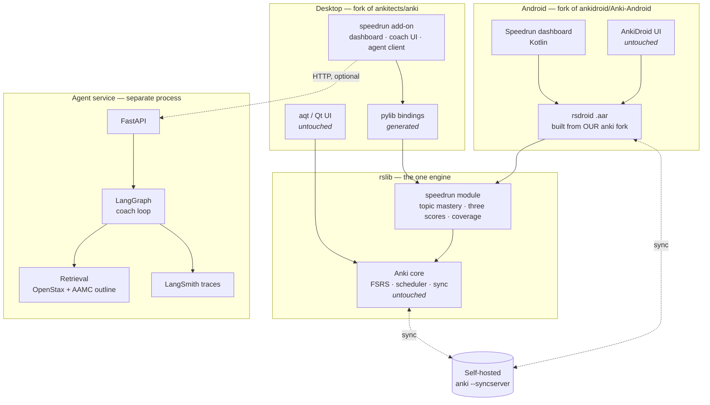

# Speedrun — Architecture

## 1. The shape

Three artifacts, one engine.



**The rule that keeps this honest:** anything both platforms must show is computed in `rslib`. The add-on renders; it does not compute.

## 2. Why an add-on plus a small fork

The Python side is an Anki add-on, not edits to `aqt`. That buys three things:

1. **The off switch is structural.** Disable the add-on and you are running stock Anki, because nothing of ours loads. Stronger than a feature flag you have to trust.
2. **"Upstream files you touched" stays short** — a graded criterion (§8, and §11's 15% "how well it fits Anki").
3. **No merge surface** against upstream Python.

What an add-on *cannot* do is add a Rust backend method, which is a hard requirement. So the fork exists, and its entire job is the `speedrun` rslib module plus one proto file.

Use `gui_hooks` rather than monkeypatching. The difference between fitting Anki and fighting it.

## 3. The Rust change

New file `proto/anki/speedrun.proto`, new module `rslib/src/speedrun/`.

```protobuf
service SpeedrunService {
  // Per-topic mastery + average recall. Must be fast on 50k cards.
  rpc TopicMastery(TopicMasteryRequest) returns (TopicMasteryResponse);
  // The three scores, with ranges and abstention reasons.
  rpc SectionScores(SectionScoresRequest) returns (SectionScoresResponse);
}

message TopicMasteryRequest {
  string section = 1;          // "CP" | "BB" | "PS"
  int64  as_of_ms = 2;         // caller-supplied clock, for reproducibility
}

message TopicMasteryResponse {
  repeated TopicMastery topics = 1;
  uint32 cards_considered = 2;
  uint32 cards_excluded = 3;   // Speedrun::Attempt notes filtered out
}

message TopicMastery {
  string topic_id = 1;         // AAMC outline node
  float  mean_retrievability = 2;
  float  ci_low = 3;
  float  ci_high = 4;
  uint32 card_count = 5;
  uint32 review_count = 6;
  bool   covered = 7;
}

message SectionScoresResponse {
  Score memory = 1;
  Score performance = 2;
  Score readiness = 3;
  float coverage_pct = 4;
  int64 computed_at_ms = 5;
}

message Score {
  bool   available = 1;        // false ⇒ give-up rule fired
  float  estimate = 2;
  float  range_low = 3;
  float  range_high = 4;
  string abstain_reason = 5;   // populated iff !available
  repeated string reasons = 6; // top drivers, shown in UI
  Confidence confidence = 7;
}
```

**Why this belongs in Rust** (the required one-page note, in short): it is a read path over the review log that both platforms need, offline, under 500 ms on 50k cards. In Python it would be a per-row round trip through the bindings; in Kotlin it would be a second implementation of the same math that must agree with the first to the decimal, which is not something you can prove in a week. One implementation, next to the data, called by both.

**Registration — verified 2026-08-02, no risk.** `rslib/proto/rust.rs::gather_proto_paths` does a `read_dir` over `proto/` and takes everything ending in `.proto`. New files are auto-discovered; `get_services()` then generates the Rust trait plus the Python and TypeScript interfaces from the descriptor pool. Nothing to register by hand. (The earlier fallback of appending to `stats.proto` is unnecessary.)

**Integration points — the whole diff against upstream (built and verified 2026-08-02):**

| File | Change |
|---|---|
| `proto/anki/speedrun.proto` | new |
| `rslib/src/speedrun/{mod,service,mastery,scores,thresholds}.rs` | new |
| `pylib/tests/test_speedrun.py` | new |
| `rslib/src/lib.rs` | one line: `pub mod speedrun;` |
| `rslib/proto/src/lib.rs` | one line: `protobuf!(speedrun, "speedrun");` |
| `pylib/anki/collection.py` | one line: `speedrun_pb2` added to the import block |

**Three upstream lines touched**, all of them the same registration each existing proto already performs. That is the answer to "the upstream files you touched" and to §11's "how well it fits Anki."

The service is implemented exactly as `stats` does it — `impl crate::services::SpeedrunService for Collection` in `speedrun/service.rs`. Backend dispatch and the Python/TypeScript bindings are generated.

**Two integration requirements that aren't obvious from reading the code:**

1. Every collection service must be paired with an empty `Backend*Service` in the same proto file — `proto_gen` asserts the two counts are equal. `stats.proto` does the same thing.
2. Prost renders proto message fields as `Option<T>`, so `SectionScoresResponse.memory` is `Option<Score>`.

**Undo and corruption:** both methods are pure reads. No `Op`, no undo entry, no collection mutation. That is deliberate — it makes "prove undo works and the collection does not corrupt" nearly free.

## 4. Data model — where coach data lives

It must ride Anki's own sync, or the phone has nothing to display.

| Data | Location | Why |
|---|---|---|
| Per-attempt log (item, confidence, timing, result, transcript ref) | Notes of notetype `Speedrun::Attempt`, own deck, **cards suspended** | Syncs natively, merges per-record, no size ceiling |
| Coverage map, thresholds, model version, last score snapshot | `col.set_config()` | Small, bounded; whole-blob write is fine |
| Per-card "recognition-only" flag | Card `custom_data`, < 100 bytes | Travels with the card; FSRS shares this field |
| Voice transcripts | Agent service, referenced by id | Large, not needed on phone |

**Rejected: a new SQLite table.** Anki's sync protocol doesn't know about it, so it wouldn't replicate, and a schema change risks forcing a one-way full sync — which would break both the "all 20 land once" test and "zero corrupted collections."

**Rejected: writing attempts into `revlog`.** That contaminates FSRS with data it should never see. It is exactly the sensor corruption SpikyPOV 5 is about.

**Rejected: everything in `col config`.** Config values are last-write-wins on the whole blob. Two devices logging offline would silently destroy one side. Rule: nothing both devices write independently goes in config.

### The contamination trap
`Speedrun::Attempt` notes create cards, and cards enter mastery and coverage queries. They are suspended, in their own deck, **and filtered by notetype inside every Rust query**. `cards_excluded` in the response exists so the count is visible and testable. Without this, our own coach data inflates the numbers we grade ourselves on — the "a score that rose only from leakage" break-test.

## 5. SpikyPOV 5, restated

The original wording was "never write to the deck." That stopped being true the moment our app *is* Anki and reviews write to the log by design. The claim underneath survives:

> We never modify the student's notes, cards, or review history. Our own records are additive, namespaced, suspended, and excluded from every measurement. The sensor stays untouched; we store our readings beside it.

Logged in the BrainLift's "what changed" section.

## 6. Agent service

Separate process, not inside Anki's bundled Python — LangGraph's dependency tree does not belong in a Qt app, and the phone could never run it.

```
POST /coach/turn      { session_id, step, audio | text } → { prompt, source_id, span, next_step }
POST /item/generate   { topic_id, dok }                  → { item, source_id, span } | 409 ungrounded
GET  /health
```

- **Graph state carries `{output, source_id, span}` on every node.** Source attribution is structural, not something you remember to log. An output that reaches the boundary without a source is dropped.
- Nodes map onto the seven coach steps. Checkpointer for resumability.
- **LangSmith** for traces (fastest to stand up next to LangGraph; Langfuse if self-hosting is required).
- Desktop treats the service as optional. Unreachable service ⇒ `ai_enabled` behaves as false. This makes the "AI service offline or returning garbage" break-test a one-liner.

### Voice capture
Anki's reviewer is a Qt WebEngine webview, so the coach UI is a web page. Capture with `MediaRecorder` in the webview, POST audio to the service for STT, TTS back. No native audio stack, no second implementation.

## 7. Sync

- Self-hosted `anki --syncserver`, built from the same fork. Both clients point at it.
- Attempt notes and config ride the normal protocol. No custom sync code.
- **Conflict rule, written before the test is run:** normal sync merges by USN; for a card reviewed on both devices offline, both revlog entries are retained and card state resolves to the higher `mod` timestamp. Attempt notes are separate records and both survive. A clock-skewed device is detected by comparing `mod` against server time on connect and is refused rather than merged.

## 8. Repo layout

The submission is **the anki fork**. Everything ships inside it.

```
anki/                          ← fork, push to your GitHub, AGPL-3.0-or-later
  proto/anki/speedrun.proto    ← new
  rslib/src/speedrun/          ← new: mod.rs, mastery.rs, scores.rs, thresholds.rs, tests
  qt/aqt/…                     ← untouched
  speedrun/
    addon/                     ← Python add-on: dashboard, coach UI, agent client
    agent/                     ← FastAPI + LangGraph service
    corpus/                    ← AAMC outline, OpenStax chunks, index
    eval/                      ← held-out sets, leakage script, calibration, retrieval baseline
    docs/                      ← these documents + the Rust rationale note
    bench/                     ← make bench
Anki-Android/                  ← second fork, linked from the main README
```

Current state: both repos sit in `Superbuilders/`, `origin` still points at upstream. Fork on GitHub and re-point `origin` before the first commit. Move `anki_v2/docs/` into `anki/speedrun/docs/` at that point.

## 9. Toolchain state (verified 2026-08-02)

| Requirement | Status |
|---|---|
| Rust 1.92.0 (`rust-toolchain.toml`) | ❌ **not installed** — critical path |
| Python ≥ 3.12 | ✅ 3.14.6 |
| uv | ✅ 0.10.10 |
| Node | ✅ v26.2.0 |
| JDK 17+ for AnkiDroid | ❌ Java 1.8 on PATH |
| Android SDK + AVD | ✅ SDK present, `Medium_Tablet` AVD |
| rsdroid (`ankidroid/Anki-Android-Backend`) | ❌ not cloned — needed to ship the Rust change to the phone |
| anki fork | ❌ `origin` = upstream, clean at v26.05 |
| AnkiDroid fork | ❌ `origin` = upstream |
