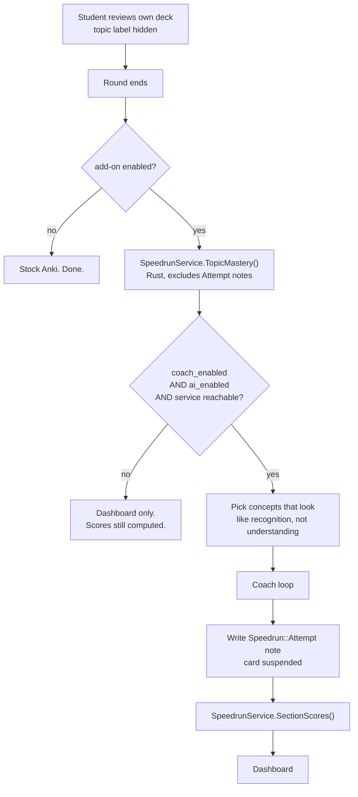
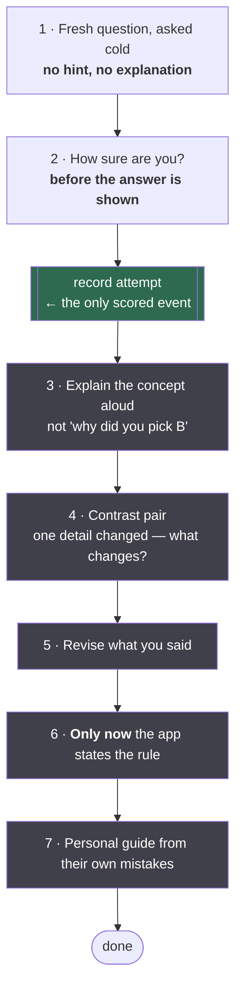
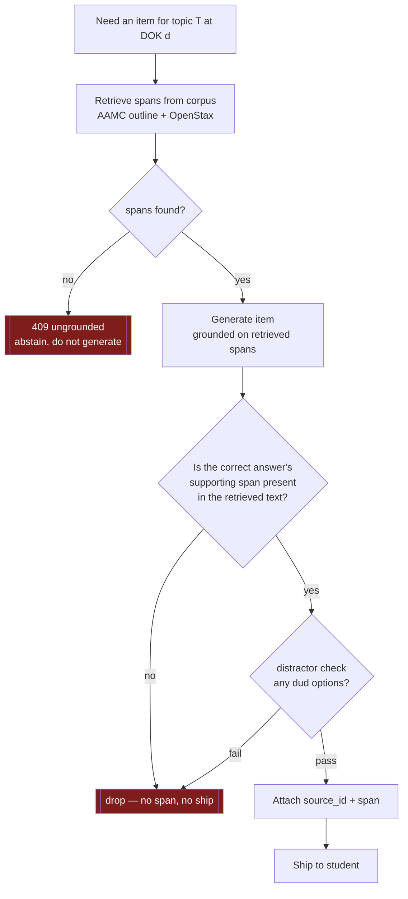
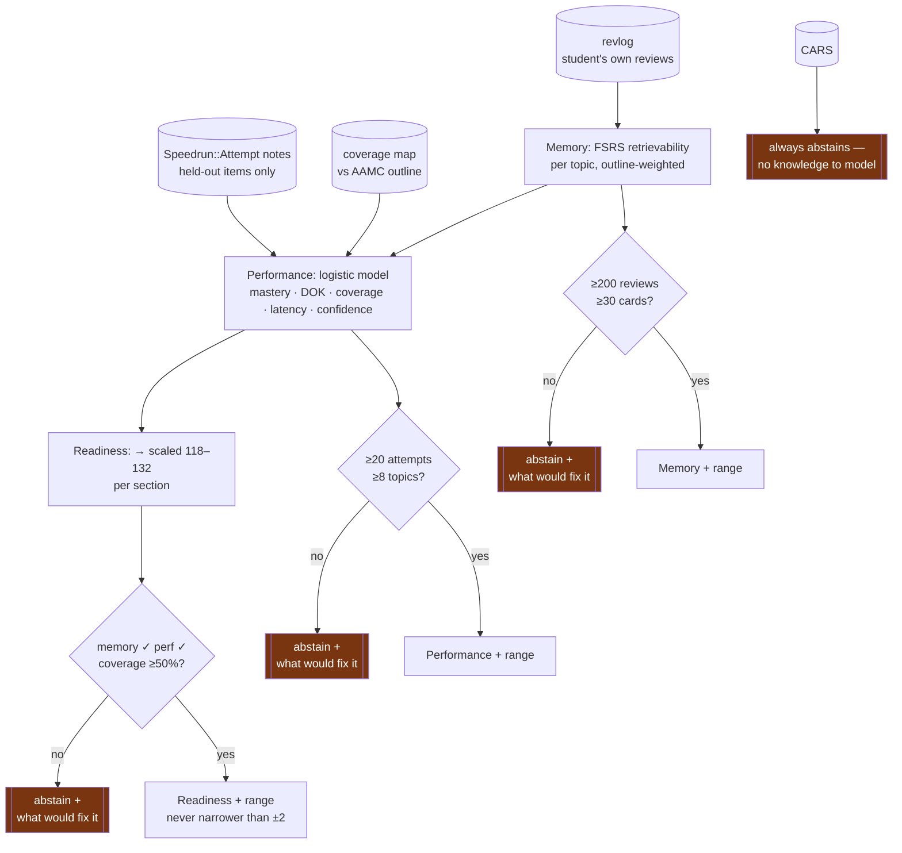
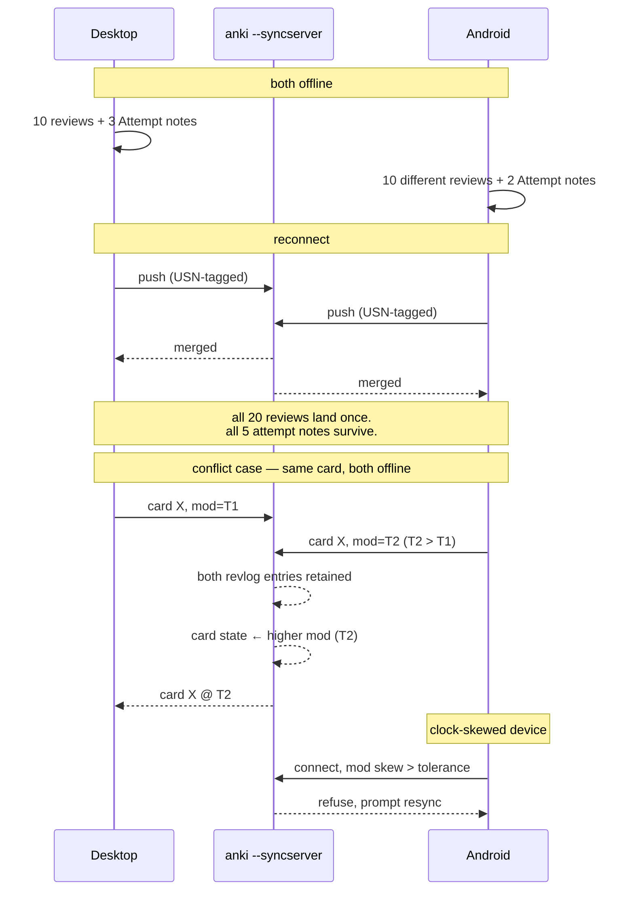
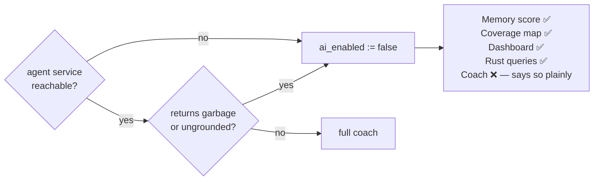

# Speedrun — Flows

## 1. Session: review → diagnose → coach

## 2. The coach loop — only step 1 scores

Grey steps are **teaching and are never graded**. The agent asks once, then stays quiet — Bisra excluded studies where a researcher kept nudging, because constant prompting turns reflection into rambling.

Voice only. No text box exists on any screen showing a live question — that is the enforcement mechanism, not a preference.

## 3. Item generation — the safety gate

**Banned:** asking an LLM whether its own item is good. The Glianorex result — models scoring 64% on questions about a fictional organ while physicians scored 27% — settles it. Generator and checker share the blind spot.

The gate is a **safety gate, not a quality dial**. Kämmer: a list containing the answer → 75%; no list → 49%; a list *missing* the answer → 43%, worse than no help at all. An ungrounded item is worse than abstaining.

## 4. Scoring pipeline and the give-up rule

Abstention is the default state. A score appears only when it is earned, and every abstention names the specific thing that would resolve it.

## 5. Sync and conflict

Rule written down before the test runs, per §8.

## 6. Degradation

Performance and readiness keep whatever they had, timestamped and marked stale. They do not silently drift.
