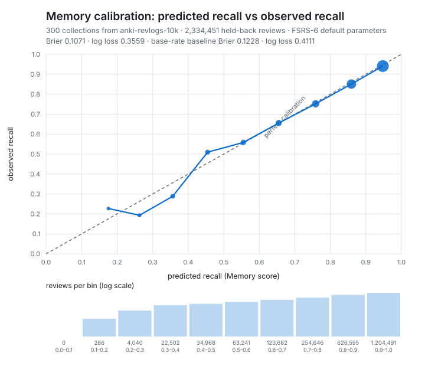

# Memory calibration — measured, not asserted

**Run on 2026-08-02.** Ticket [T-05](https://github.com/rubanikov/anki/issues/6).

The product claims a Memory score of 0.80 means the student recalls that material
about 80% of the time. This file is that claim as a number, measured on
**2 334 451 real reviews held back from 300 real Anki collections** and never
shown to the model.

| | |
|---|---|
| **A Memory score of 0.80 was right** | **79.2% of the time** (35 297 reviews, 95% CI 78.8–79.6%) |
| **Brier score** | **0.1071** |
| **Log loss** | **0.3559** |
| Baseline — predict the base rate (0.8587) for every review | Brier **0.1228**, log loss **0.4111** |
| Expected calibration error (10 fixed-width bins) | 0.0082 |
| Expected calibration error (10 equal-count bins) | 0.0069 |
| AUC (discrimination, not calibration) | 0.7545 |
| Mean predicted recall vs observed recall | 0.8629 vs **0.8566** |

**The finding, in one line: the claim survives — a Memory score of 0.80 was right
79.2% of the time — and the model is very slightly optimistic throughout.**
Across 2.3 million held-back reviews it predicts 86.3% recall and observes 85.7%,
overstating the student by **0.6 percentage points**. Every fixed-width bin from
0.5 upward — 97.4% of the held-back reviews — sits within 0.9 points of the
diagonal, and the model beats a base-rate predictor on both scores. But where it
errs it errs upward, which is the direction a readiness product must not be
trusted in blindly, and 0.80 meaning 79.2% is a statement whose 95% interval does
not reach 80%. Both are stated here rather than rounded away.



---

## 1. The claim, asked directly

Of the held-back reviews the Memory model scored at *x*, what fraction did the
student actually recall? Bands are *x* ± 0.005; the interval is Wilson 95%.

| Memory score | reviews | mean predicted | observed | Wilson 95% |
|---|---|---|---|---|
| 0.50 ± 0.005 | 5 596 | 0.4999 | 0.5357 | 0.5227–0.5488 |
| 0.60 ± 0.005 | 10 284 | 0.5996 | 0.5980 | 0.5885–0.6075 |
| 0.70 ± 0.005 | 18 718 | 0.6996 | 0.6904 | 0.6837–0.6969 |
| 0.75 ± 0.005 | 20 895 | 0.7500 | 0.7441 | 0.7381–0.7500 |
| **0.80 ± 0.005** | **35 297** | **0.7998** | **0.7918** | **0.7875–0.7960** |
| 0.85 ± 0.005 | 61 457 | 0.8503 | 0.8445 | 0.8417–0.8474 |
| 0.90 ± 0.005 | 108 095 | 0.9001 | 0.8946 | 0.8928–0.8964 |
| 0.95 ± 0.005 | 280 698 | 0.9489 | 0.9380 | 0.9371–0.9389 |

**A Memory score of 0.80 was right 79.2% of the time** — 35 297 held-back
reviews, 95% interval 78.8%–79.6%. The claim holds, and the honest way to say it
is *0.80 means about 79%, not 80%*: the true value is 0.8 points below the
stated one and the interval does not reach 80%. Every band from 0.60 up is
optimistic by between 0.2 and 1.1 points. The 0.50 band is the one exception and
is the smallest.

## 2. Reliability, binned by predicted value

Fixed-width bins — the chart above, as numbers. `Δ` is observed − predicted, so
a negative `Δ` means the model was optimistic.

| predicted | mean predicted | observed | Δ | reviews |
|---|---|---|---|---|
| 0.0–0.1 | — | — | — | 0 |
| 0.1–0.2 | 0.1754 | 0.2273 | +0.0519 | 286 |
| 0.2–0.3 | 0.2629 | 0.1931 | −0.0698 | 4 040 |
| 0.3–0.4 | 0.3565 | 0.2885 | −0.0680 | 22 502 |
| 0.4–0.5 | 0.4547 | 0.5094 | +0.0547 | 34 968 |
| 0.5–0.6 | 0.5551 | 0.5584 | +0.0033 | 63 241 |
| 0.6–0.7 | 0.6547 | 0.6554 | +0.0007 | 123 682 |
| 0.7–0.8 | 0.7586 | 0.7522 | −0.0064 | 254 646 |
| 0.8–0.9 | 0.8595 | 0.8510 | −0.0085 | 626 595 |
| 0.9–1.0 | 0.9478 | 0.9410 | −0.0068 | 1 204 491 |

The four bins below 0.5 hold 2.6% of the reviews between them and swing by up to
7 points in both directions — they are the thin, noisy tail, and they are shown
rather than hidden. The bins that carry the product — 0.7 and above, 89% of all
held-back predictions — are each within 0.9 points of the diagonal.

Predicted recall piles up near 1.0, which is what fixed-width bins are bad at.
The same reviews cut into ten **equal-count** bins instead:

| predicted range | reviews | mean predicted | observed | Δ |
|---|---|---|---|---|
| 0.000–0.692 | 234 706 | 0.5597 | 0.5628 | +0.0032 |
| 0.692–0.795 | 252 004 | 0.7526 | 0.7450 | −0.0076 |
| 0.795–0.851 | 236 715 | 0.8252 | 0.8154 | −0.0098 |
| 0.851–0.882 | 242 253 | 0.8674 | 0.8589 | −0.0085 |
| 0.882–0.907 | 233 838 | 0.8944 | 0.8885 | −0.0059 |
| 0.907–0.929 | 237 255 | 0.9167 | 0.9123 | −0.0044 |
| 0.929–0.948 | 335 882 | 0.9411 | 0.9316 | −0.0095 |
| 0.948–0.965 | 241 356 | 0.9552 | 0.9521 | −0.0031 |
| 0.965–0.991 | 239 602 | 0.9775 | 0.9685 | −0.0090 |
| 0.991–1.000 | 80 840 | 0.9953 | 0.9873 | −0.0080 |

Nine of ten bins are optimistic by between 0.3 and 1.0 points. The bias is small
and it is **consistent** — that is a real property of the model, not sampling
noise, and it is why the headline above says "very slightly optimistic" rather
than "calibrated".

The raw 0.001-wide histogram these tables are cut from is in
[`results.json`](./results.json) under `grid`, so anyone can re-bin the result —
or disagree with the binning — without re-running anything and without holding
the corpus.

## 3. Per collection, not just pooled

A pooled number lets the largest two or three collections speak for the other
297. The same metrics computed inside each collection and then summarised across
all 300:

| | min | p25 | median | p75 | max | mean |
|---|---|---|---|---|---|---|
| Brier | 0.0028 | 0.0697 | **0.1070** | 0.1581 | 0.6268 | 0.1182 |
| Log loss | 0.0347 | 0.2613 | **0.3570** | 0.4926 | 1.7364 | 0.3848 |
| Observed recall | 0.1041 | 0.7776 | 0.8764 | 0.9361 | 1.0000 | 0.8406 |
| Mean predicted recall | 0.4302 | 0.8021 | 0.8503 | 0.8895 | 0.9712 | 0.8353 |

The pooled Brier (0.1071) and the per-collection median (0.1070) agree, so the
pooled number is not an artefact of a few huge collections. The spread is wide:
a quarter of collections score worse than 0.158 Brier, and the worst scores
0.627. **Calibration is a property of the population here, not a guarantee for
any individual student.** One collection's observed recall is 0.10 — a user who
presses Again on almost everything — and no fixed parameter set can be calibrated
for them.

## 4. Is 0.1071 / 0.3559 good?

Judged against a baseline and against the published benchmark for this same
corpus, since a Brier score alone means nothing.

| | Brier | log loss | AUC |
|---|---|---|---|
| **Memory model, this run** (pooled) | **0.1071** | **0.3559** | **0.7545** |
| **Memory model, this run** (mean over 300 collections) | 0.1182 | 0.3848 | — |
| Base-rate baseline: predict 0.8587 for everything | 0.1228 | 0.4111 | 0.5 by construction |

The model beats the base-rate baseline by 13% on Brier and 13% on log loss, and
its AUC of 0.75 says it is genuinely ranking reviews rather than emitting a
well-calibrated constant. Both matter: a constant predictor can be perfectly
calibrated and completely useless, and the AUC is what separates those cases.

Against the [SRS Benchmark](https://github.com/open-spaced-repetition/srs-benchmark),
which evaluates on the whole of this corpus (9 999 collections, 349 923 850
reviews, same-day reviews excluded, per-user parameter training, metrics averaged
over users):

| model | log loss | RMSE(bins) | AUC |
|---|---|---|---|
| FSRS-6, parameters trained per user | 0.3460 | 0.0653 | 0.7034 |
| FSRS-7 with default parameters | 0.3629 | 0.0910 | 0.6944 |
| **This run: FSRS-6, default parameters, mean over collections** | **0.3848** | — | — |
| AVG (each user's own average, constant) | 0.3945 | 0.1034 | 0.4997 |

That is where it should sit and is the strongest evidence the pipeline is
measuring the real model rather than a bug: worse than trained FSRS-6 (0.3460),
worse than a default-parameter FSRS-7 (0.3629) — because **nothing here is
fitted** — and better than a per-user constant (0.3945). The protocols are not
identical (300 collections not 9 999, a last-20%-by-time holdout not the
benchmark's split, pooled and per-collection rather than the benchmark's
averaging), so these are neighbouring numbers, not directly comparable ones.

**The gap between 0.3848 and 0.3460 is what "Optimize" buys a student.** This run
deliberately measures the model as shipped, before any per-user optimisation.

## 5. What was measured, exactly

**The curve is the backend's curve.** `rslib/src/speedrun/mastery.rs` computes a
Memory score as

```rust
fsrs::current_retrievability(state.into(), elapsed_days, card.decay.unwrap_or(FSRS5_DEFAULT_DECAY))
```

[`fsrs_model.py`](./fsrs_model.py) is a transcription of that function and of the
memory-state forward pass around it, from `fsrs` 6.6.1 — the version pinned in
the workspace `Cargo.toml`. It checks itself against the crate's own unit-test
vectors on every run (`python speedrun/eval/calibration/fsrs_model.py`); the
residual is at the 1e-7 level, from Python being f64 where the crate is f32.
`current_retrievability(state, t, w[20])` and `power_forgetting_curve(w, t, s)`
are the same function, so the curve scored here is the curve the dashboard
reports.

**The revlog handling is the backend's handling.** [`calibrate.py`](./calibrate.py)
reproduces `reviews_for_fsrs(..., training=false, ...)` from
`rslib/src/scheduler/fsrs/params.rs` — the path Anki uses to derive the memory
state `mastery.rs` reads. Cramming entries dropped, history before a card reset
dropped, entries before the last group of learning steps dropped, truncated
histories seeded from SM2 exactly as `fsrs_item_for_memory_state` does
(`historical_retention = 0.9`, the deck-config default). `delta_t` is
`days_elapsed(previous) − days_elapsed(current)` against each collection's own
`next_day_at`.

**Parameters: FSRS-6 defaults, nothing fitted.** Every collection is scored with
`fsrs 6.6.1 DEFAULT_PARAMETERS` (decay `w[20] = 0.1542`). No parameter is
estimated from any review, held out or not.

**What counts as a scorable review.** A held-back review is scored when it is not
the first review of its card and its `delta_t > 0` — the two conditions FSRS
itself requires to form an item. Same-day repeats and first exposures are
*stepped through* (they move the memory state) but not scored, because the model
does not claim a recall probability for them.

| | |
|---|---|
| Collections in the slice | 300 |
| Collections with ≥ 5 reviews (all of them) | 300 |
| Cards | 2 462 761 |
| Reviews | 18 905 862 |
| Held back by the H1 rule (20%) | 3 781 295 |
| — of those, scorable | **2 334 451** |
| — of those, not scorable (first exposure or same-day repeat) | 1 446 844 |
| Predictions seeded from SM2 (truncated history) | 17 332 |
| Fitting-set reviews scored (baseline base rate only) | 8 126 904 |

38% of held-back reviews are unscorable. That is not a filter chosen to flatter
the result — it is what the model refuses to be asked about — and the denominator
is printed above rather than left to be inferred.

Splitting the held-back set by how the card's starting state was derived:

| | reviews | Brier | log loss | observed |
|---|---|---|---|---|
| Full review history | 2 317 119 | 0.1075 | 0.3571 | 0.8561 |
| SM2-seeded (history truncated) | 17 332 | 0.0581 | 0.1916 | 0.9244 |

The SM2-seeded slice is 0.7% of the total and does not move the headline.

## 6. The data, and exactly how it was sampled

The corpus is
[`anki-revlogs-10k`](https://huggingface.co/datasets/open-spaced-repetition/anki-revlogs-10k):
~727M real reviews from 10 000 real Anki users, the corpus FSRS itself is
benchmarked on, chosen in
[ADR-0001](../../docs/adr/0001-calibration-uses-a-public-review-log-corpus.md).
**No review here is simulated.** A calibration chart built on invented reviews
would be a guess dressed as a measurement, and the ADR rejects it outright.

**Which distribution.** The processed distribution is **gated**: its parquet
files return HTTP 401 without a Hugging Face token, and no token exists on the
machine that ran this. The same publisher hosts
[`anki-revlogs-10k-raw`](https://huggingface.co/datasets/open-spaced-repetition/anki-revlogs-10k-raw)
— ungated, same `anki-revlogs-10k` licence, described by the publisher as "the
original data of open-spaced-repetition/anki-revlogs-10k", exported by Anki's own
`Collection::export_dataset`. That is what was downloaded: the same corpus, not a
stand-in for it. It is also the better fit here, because its records carry each
review's epoch-millisecond timestamp, `review_kind` and `ease_factor`, which is
what makes the backend's own filtering reproducible.

**The sampling rule, stated in full — an unstated sampling rule is an unstated
result:**

1. Revision pinned to `197633e5ec9f4a177f285447053329db40e2eb5e`; the archive
   `revlogs.7z` is 8 459 427 959 bytes, sha256
   `2921e71e2d39156eef198c8516078ec7806d74443900c0a1005f3c4467389f95`.
2. The archive is solid, in 8 LZMA2 blocks. Block 0 holds the first **1315**
   `.revlog` entries in archive order. Only block 0's packed bytes were fetched
   — 1 107 379 967 of 8 459 427 959. That bound is the reason the slice is a
   slice.
3. From those 1315 collection ids, sorted ascending as strings,
   `random.Random(20260802).sample` drew **300**. The seed is the one already
   pre-registered in [`MANIFEST.md`](../holdout/MANIFEST.md) for H4, fixed before
   any score existed, and was not re-rolled.
4. No filtering on collection size, age, retention or behaviour. Whatever the
   sample contained was scored.

Per-collection ids, byte counts and SHA-256s are in
[`corpus_slice.json`](./corpus_slice.json).

**This is a convenience slice, not a uniform random sample of the full 10 000.**
Step 2 restricts the draw to the 1315 collections that happen to sit in the
archive's first block; step 3 randomises only within those. Archive order is
lexicographic on the dataset builder's collection id, which should be unrelated
to how anyone studies, but "should be unrelated" is an argument, not a
measurement. Read the numbers as: 300 collections drawn at random from a
1315-collection block of the corpus.

**The licence permits individual research use and forbids public
redistribution.** No raw corpus file and no derivative containing review rows is
in this repository. The `.gitignore` entries that enforce that are checked by
`freeze.py --verify`, which fails if the raw slice is present or if an ignore
rule has been deleted. The downloaded slice was removed with
`fetch_slice.py --clean` once this run finished; `h1_reviews.jsonl` stays local
and `.gitignore`d, with its SHA-256 recorded in the manifest so the run can be
re-verified byte-for-byte by whoever has the corpus.

## 7. The split (H1), fixed before any of this existed

Taken verbatim from [`MANIFEST.md`](../holdout/MANIFEST.md), frozen at
`2026-08-02T08:12:41Z`, before any calibration code was written and before any
score existed. It was applied unchanged:

1. Group every review by collection.
2. Within a collection, sort ascending by review timestamp; ties break on
   `(card_id, review_th)`.
3. The **last ⌈0.20 × n⌉ reviews of each collection** are H1, held out. The rest
   is the fitting set. Never pooled across collections — a global time split
   would leak one user's future through another user's past.
4. Collections with fewer than 5 reviews contribute nothing (none here).
5. Deterministic: no sampling, no shuffling, no seed.

"Review" means a revlog entry with a rating that affects scheduling
(`RevlogEntry::has_rating_and_affects_scheduling`); manual reschedules, resets
and cramming entries are not reviews. `review_th` is not a column in the raw
distribution — it is the review's 1-based rank under exactly the total order
step 2 describes, and is written into each H1 row as `th`.

**The holdout is honoured but not load-bearing here.** Because no parameter is
fitted, no outcome — held out or not — touches the model. The split was applied
exactly as pre-registered anyway, so every number above is computed on precisely
the pre-declared subset and on nothing else. It would become load-bearing the
moment anyone fits parameters, which is why it was frozen first.

## 8. Reproducing this

```bash
# 1. the FSRS port checks itself against the crate's own test vectors
python speedrun/eval/calibration/fsrs_model.py

# 2. fetch the bounded slice into the .gitignore'd raw path (needs `pip install py7zr`;
#    downloads ~1.1 GB, writes ~800 MB)
python speedrun/eval/calibration/fetch_slice.py --collections 300

# 3. split, predict, score, and write the chart (stdlib only; ~5 minutes)
python speedrun/eval/calibration/calibrate.py

# 4. record H1's SHA-256 in the manifest
python speedrun/eval/holdout/freeze.py --freeze --set H1

# 5. delete the licensed slice, then prove it is gone
python speedrun/eval/calibration/fetch_slice.py --clean
python speedrun/eval/holdout/freeze.py --verify      # must exit 0
```

Steps 2–3 are deterministic given the pinned revision and seed. Step 3 needs no
third-party package: the reliability chart is SVG that `calibrate.py` writes
itself, so nothing about this result depends on a plotting library being
installed.

What this run produced, for anyone re-running it:

| | |
|---|---|
| `h1_reviews.jsonl` | 341 240 865 bytes, 3 781 295 records, sha256 `3563d7a6f385ac7e4277d749c943f61ef96e879a38bcaddc1f037a6f33e2e257` |
| `freeze.py --verify` after `--clean` | exit **0** |

The H1 hash is in [`MANIFEST.md`](../holdout/MANIFEST.md) too. The file itself is
not in this repository and never will be — the hash is what lets someone who has
the corpus prove they scored the same bytes.

## 9. What this does **not** show

**This corpus has no card text and no topic tags, so it validates the Memory
model and says nothing about MCAT topic mastery.**

The `anki-revlogs-10k` records are card ids, timestamps, ratings and intervals.
There is no question, no answer, no deck name that means anything, no subject.
So this run can say the Memory model's probabilities are honest, and it cannot
say anything at all about:

- **Topics** — nothing here maps a card to a subject, so the Crosswalk is
  untested by this file.
- **Coverage** — "how much of the exam does this deck touch" needs card content
  this corpus does not carry.
- **Performance** — no exam-style item is answered anywhere in this corpus.
- **Readiness** — a scaled section score cannot be evidenced from review logs
  with no subject attached.
- **Any MCAT-specific claim.** These are 10 000 Anki users studying whatever they
  study. Nothing establishes that a well-calibrated recall probability on their
  cards transfers to a premed's MCAT preparation, and nothing here should be
  cited as if it did.

A Memory score of 0.80 having been right 79.2% of the time is a statement about
*recall of a card the student has already seen*. Whether that survives an
exam-style question the student has never seen is the paraphrase test's job
(H4/H2), and it is measured separately and may well come out worse.

## 10. Everything else that limits this number

- **Default parameters, not optimised ones.** Every collection was scored with
  FSRS-6 defaults. Real users who run "Optimize" get better-calibrated scores
  (the benchmark's 0.3460 against this run's 0.3848); users who never do get
  approximately this. Reported as the shipped, unoptimised case on purpose.
- **300 collections from one 1315-collection block**, not a uniform draw from the
  full 10 000. See §6.
- **The raw distribution, not the one the manifest originally named.** The
  processed distribution is gated and unreachable without a Hugging Face token.
  The raw one is the same corpus from the same publisher under the same licence,
  and the substitution is recorded as an amendment in
  [`MANIFEST.md`](../holdout/MANIFEST.md) rather than made quietly. Anyone with a
  token should be able to reproduce these numbers from the processed
  distribution; that has not been done here, so it is a claim, not a check.
- **The model is slightly optimistic** — 0.6 points pooled, and 9 of 10
  equal-count bins lean the same way. Small, consistent, and in the direction
  that flatters a readiness product.
- **Per-collection spread is wide.** Median Brier 0.107, upper quartile 0.158,
  worst 0.627. Population calibration is not a per-student guarantee.
- **38% of held-back reviews are unscorable** (first exposures, same-day
  repeats). The model makes no claim about those, so neither does this file.
- **f64 here, f32 in the backend.** The port's residual against the crate's test
  vectors is ~1e-7 — four orders of magnitude below anything reported here to
  four decimals.
- **Same-day reviews are excluded from scoring** (they are still stepped
  through). This matches the benchmark's primary configuration; the with-same-day
  configuration is a different and harder number that was not measured.
- **This is one run of one script.** It has not been repeated on a second slice,
  so it carries no estimate of how much the headline would move with a different
  300 collections. The per-collection quantiles in §3 are the closest thing to
  that here.
